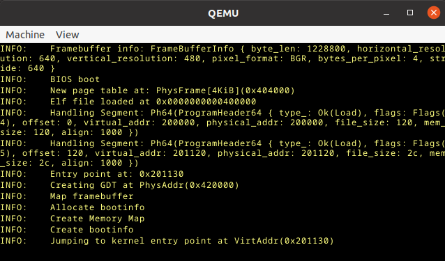

+++
title = "This Month in Rust OSDev (January 2022)"
date = 0000-01-01

[extra]
month = "January 2022"
authors = [
    "phil-opp",
    "ColinFinck",
    # add yourself here
]
+++

Welcome to a new issue of _"This Month in Rust OSDev"_. In these posts, we give a regular overview of notable changes in the Rust operating system development ecosystem.

<!-- more -->

This series is openly developed [on GitHub](https://github.com/rust-osdev/homepage/). Feel free to open pull requests there with content you would like to see in the next issue. If you find some issues on this page, please report them by [creating an issue](https://github.com/rust-osdev/homepage/issues/new) or using our [_comment form_](#comment-form) at the bottom of this page.

<!--
    This is a draft for the upcoming "This Month in Rust OSDev (January 2022)" post.
    Feel free to create pull requests against the `next` branch to add your
    content here.
    Please take a look at the past posts on https://rust-osdev.com/ to see the
    general structure of these posts.
-->

## Project Updates

In this section, we give an overview of notable changes to the projects hosted under the [`rust-osdev`] organization.

[`rust-osdev`]: https://github.com/rust-osdev/about

### [`x86_64`](https://github.com/rust-osdev/x86_64)

The `x86_64` crate provides various abstractions for `x86_64` systems, including wrappers for CPU instructions, access to processor-specific registers, and abstraction types for architecture-specific structures such as page tables and descriptor tables.

In January, we merged the following pull requests:

- [Add `Cr2::read_raw`](https://github.com/rust-osdev/x86_64/pull/334)
- [Add support for `MXCSR` register](https://github.com/rust-osdev/x86_64/pull/336)
- [Bump version to `0.14.8`](https://github.com/rust-osdev/x86_64/pull/339)

Thanks to [@jarkkojs](https://github.com/jarkkojs) for their contribution!

### [`multiboot2`](https://github.com/rust-osdev/multiboot2)

The `multiboot2` crate provides abstraction types for the boot information of multiboot2 bootloaders.
The latest release of the `multiboot2`-crate is now `v.0.13.1` (was `v0.12.2`). It contains minor improvements,
such as new getters that were originally missing.

The combined diff of all changes can be found [here](https://github.com/rust-osdev/multiboot2/compare/multiboot2-header-v0.1.0...multiboot2-v0.13.1).

## Call for Participation

Want to contribute to a Rust OSDev project, but don't know where to start? Pick up one of these outstanding
issues in one of our projects and get started!

<!--
Please use the following template for adding items:
- [(`repo_name`) Issue Description](https://example.com/link-to-issue)
-->

_No tasks were proposed for this section._

If you maintain a Rust project related to operating system development and are looking for contributors, especially for tasks suited to people getting started in this space, please [create a PR](https://github.com/rust-osdev/homepage/pulls) against the `next` branch with the tasks you want to include in the next issue.

## Other Projects

In this section, we describe updates to Rust OS projects that are not directly related to the `rust-osdev` organization. Feel free to [create a pull request](https://github.com/rust-osdev/homepage/pulls) with the updates of your OS project for the next post.

### [`phil-opp/blog_os`](https://github.com/phil-opp/blog_os)

(Section written by [@phil-opp](https://github.com/phil-opp))

This month, ...

### [`ntfs`](https://github.com/ColinFinck/ntfs)

(Section written by [@ColinFinck](https://github.com/ColinFinck))

Colin Finck released an initial version of his [ntfs](https://github.com/ColinFinck/ntfs) crate this month, a Rust library to access Microsoft's proprietary NTFS filesystem.

For those of you who are not running Windows:
NTFS is the primary filesystem in Windows, from Windows NT's release in 1993 up to the current Windows 11.
Unlike FAT32, NTFS has no practical limits for file and partition sizes, comes with B-Tree Indexes for faster lookups, and adds a few resilience and efficiency features (such as journaling, compression, and sparse files). 

The ntfs crate supports Rust's no_std environment and is therefore not tied to a specific platform API.
It aims to be embeddable in firmware-level code and kernels just as well as in user-mode applications.

Colin Finck will [talk about NTFS](https://fosdem.org/2022/schedule/event/misc_ntfs_rust/) and his adventures in writing a filesystem crate in Rust on the upcoming FOSDEM conference.
The talk is on Saturday, 5 February at 17:00 (CET, UTC+1).
The conference is virtual and admission is free.

### [`phip1611/noto-sans-mono-bitmap-rs`](https://github.com/phip1611/noto-sans-mono-bitmap-rs)

(Section written by [@phip1611](https://github.com/phip1611))

Philipp Schuster released an initial version of his [noto-sans-mono-bitmap](https://github.com/phip1611/noto-sans-mono-bitmap-rs)
crate this month. It provides a pre-rasterized bitmap font from *Noto Sans Mono*, an open font from Google.
The crate is a replacement for legacy bitmap fonts, such as the [font8x8 crate](https://crates.io/crates/font8x8).
It is suitable for printing high quality/nice looking text to a framebuffer in bootloaders, kernels and similar 
environments where you don't want or can't use the FPU.

To avoid CPU intensive soft float workloads, the crate contains pre-rendered symbols from the [Noto Sans Mono font](https://fonts.google.com/noto/specimen/Noto+Sans+Mono)
in different sizes and font weights (light, regular, bold) as Rust constants paired with a convenient getter function.

The screenshot above shows text that is rendered into an UEFI framebuffer using the bitmap font 
from `noto-sans-mono-bitmap`.

An example of usage can be found in [PR#213](https://github.com/rust-osdev/bootloader/pull/213) of the 
`rust-osdev/bootloader` crate, where this crate was merged and replaced `font8x8`.

## Join Us?

Are you interested in Rust-based operating system development? Our `rust-osdev` organization is always open to new members and new projects. Just let us know if you want to join! A good way for getting in touch is our [gitter channel](https://gitter.im/rust-osdev/Lobby).

<!--
TODO: Update publication date
-->
