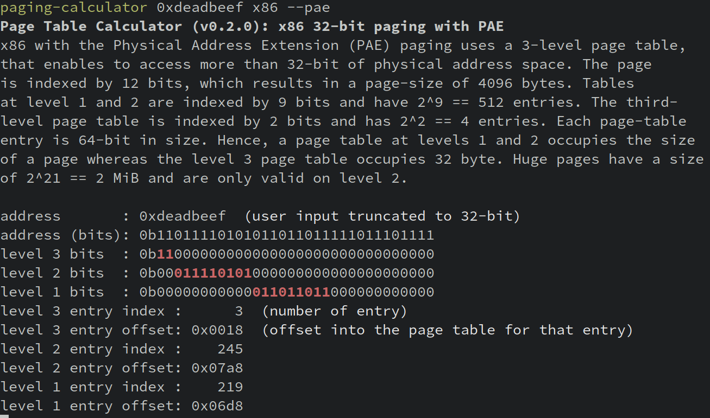

+++
title = "This Month in Rust OSDev: March 2023"
date = 2023-04-06

[extra]
month = "March 2023"
editors = ["phil-opp", "phip1611"]
+++

Welcome to a new issue of _"This Month in Rust OSDev"_. In these posts, we give a regular overview of notable changes in the Rust operating system development ecosystem.

<!-- more -->

This series is openly developed [on GitHub](https://github.com/rust-osdev/homepage/). Feel free to open pull requests there with content you would like to see in the next issue. If you find some issues on this page, please report them by [creating an issue](https://github.com/rust-osdev/homepage/issues/new) or using our <a href="#comment-form">_comment form_</a> at the bottom of this page.

<!--
    This is a draft for the upcoming "This Month in Rust OSDev (March 2023)" post.
    Feel free to create pull requests against the `next` branch to add your
    content here.
    Please take a look at the past posts on https://rust-osdev.com/ to see the
    general structure of these posts.
-->

## Infrastructure and Tooling

In this section, we collect recent updates to `rustc`, `cargo`, and other tooling that are relevant to Rust OS development.

<!--
    Please use the following template:

    ### Summary
    (Section written by [@author](https://github.com/author))

    <text>
-->

## Announcements, News, and Blog Posts

Here we collect news, blog posts, etc. related to OS development in Rust.

<!--
Please follow this template:

- [Title](https://example.com)
  - (optional) Some additional context
-->

- [Writing a Linux Driver for QEMU’s Debugcon Device](https://phip1611.de/blog/writing-a-linux-driver-for-qemus-debugcon-device/) \
  In this blogpost, [@phip1611](https://github.com/phip1611) shows you can 
  write a Linux driver for the QEMU debugcon device. Although, the driver 
  still uses C, it is a wonderful example to demonstrate a minimal yet useful
  driver. Additionally, it is a good starting point for a rewrite in Rust, once
  the Rust tooling and API bindings in the kernel are more mature. Perhaps, 
  the rewrite in Rust is your next learning project?

## `rust-osdev` Projects

In this section, we give an overview of notable changes to the projects hosted under the [`rust-osdev`] organization.

[`rust-osdev`]: https://github.com/rust-osdev/about

<!--
    Please use the following template:

    ### [`repo_name`](https://github.com/rust-osdev/repo_name)
    Maintained by [@maintainer_1](https://github.com/maintainer_1)

    The `repo_name` crate ...<<short introduction>>...

    We merged the following changes this month:
    <<changelog, either in list or text form>>
-->

## Other Projects

In this section, we describe updates to Rust OS projects that are not directly related to the `rust-osdev` organization. Feel free to [create a pull request](https://github.com/rust-osdev/homepage/pulls) with the updates of your OS project for the next post.

<!--
    Please use the following template:

    ### [`owner_name/repo_name`](https://github.com/rust-osdev/owner_name/repo_name)
    (Section written by [@your_github_name](https://github.com/your_github_name))

    ...<<your project updates>>...
-->

### [`phip1611/paging-calculator`](https://github.com/phip1611/paging-calculator)

(Section written by [@phip1611](https://github.com/phip1611))

In the November newsletter, I announced the initial release of my 
`paging-calculator` CLI utility. Recently, I released a new version, which now 
covers page table indices for x86, x86 with physical address extension (PAE), 
x86_64, and x86_64 with 5 levels. For example, just type `$ paging-calculator 0xdeadbeef x86`
and `$ paging-calculator 0xdeadbeef x86 --pae`and compare the result. You can 
install it from [crates.io](https://crates.io/crates/paging-calculator) or with 
the [`pkgs.paging-calculator` attribute](https://github.com/NixOS/nixpkgs/blob/1a165401fe904b9cd89bd731e6e8372883652c7d/pkgs/development/tools/paging-calculator/default.nix),
if you are a [Nix](https://nixos.org/) user.

## Join Us?

Are you interested in Rust-based operating system development? Our `rust-osdev` organization is always open to new members and new projects. Just let us know if you want to join! A good way for getting in touch is our [gitter channel](https://gitter.im/rust-osdev/Lobby).
